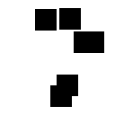
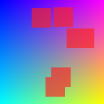

# Mini-JEPA-rs

Personal project implementing a simplified I-JEPA-style pipeline.

The main idea is to hide regions of an image, then train a model to predict representations of the hidden regions instead of directly reconstructing pixels.

This project is also used as a practical way to learn Rust. Rust is used for a small but useful part of the pipeline: image mask generation.

## Current State

The project currently includes:

- a Rust CLI that generates text or PNG masks;
- a Python pipeline to load images and masks;
- image + mask visualization;
- a small PyTorch model inspired by I-JEPA;
- a minimal training loop.

## Preview

Demo image:


Generated mask:



Masked image:



## How It Works

The pipeline is intentionally simple:

```text
image
-> hidden-region mask
-> image patches
-> visible patch embeddings
-> predicted hidden embeddings
-> comparison with target embeddings
-> training loss
```

The key difference from a classic autoencoder:

```text
Autoencoder: masked image -> reconstructed pixels
Mini-JEPA:   masked image -> predicted embeddings
```

The model is not only trying to recover colors. It learns an intermediate representation of the image.

## Installation

Install the Python project and its dependencies:

```bash
pip install -e .
```

This makes the `mini_jepa` package importable from anywhere in the repository.

Check Rust:

```bash
cargo --version
rustc --version
```

If `cargo` is not found:

```bash
source "$HOME/.cargo/env"
```

## Generate a Mask With Rust

From the repository root:

```bash
cargo run --manifest-path rust/mask-cli/Cargo.toml -- --width 128 --height 128 --block-size 24 --blocks 6 --seed 42 --output rust_mask.png
```

The file will be created here:

```text
outputs/rust_mask.png
```

From the Rust CLI directory, this also works:

```bash
cd rust/mask-cli
cargo run -- --width 128 --height 128 --block-size 24 --blocks 6 --seed 42 --output rust_mask.png
```

Even from `rust/mask-cli`, relative paths passed to `--output` are redirected to the root-level `outputs/` directory.

Without `--output`, the CLI prints a text mask:

```bash
cargo run --manifest-path rust/mask-cli/Cargo.toml -- --width 12 --height 8 --block-size 3 --blocks 3 --seed 42
```

Example:

```text
............
............
.......###..
.......###..
.......###..
............
............
............
```

## Generate Demo Images

Create a demo image:

```bash
python3 scripts/create_demo_image.py
```

Generate a Python mask:

```bash
python3 scripts/generate_python_mask.py --width 128 --height 128 --block-size 24 --blocks 6 --seed 42 --output outputs/python_mask.png
```

Visualize image + mask:

```bash
python3 scripts/visualize_mask.py --image outputs/demo_image.png --mask outputs/python_mask.png --output outputs/masked_demo.png
```

## Run Training

Minimal command:

```bash
python3 scripts/train.py --epochs 10
```

Train with a mask generated by Rust:

```bash
python3 scripts/train.py --image outputs/demo_image.png --mask outputs/rust_mask.png --epochs 10
```

Example output:

```text
epoch 001 | loss 0.061454
epoch 002 | loss 0.044359
epoch 003 | loss 0.033873
epoch 004 | loss 0.026747
epoch 005 | loss 0.021976
```

The loss should generally go down. This means the predictor is learning to move its predicted embeddings closer to the target embeddings.

## Full Rust + Python Demo

Manual flow:

```bash
python3 scripts/create_demo_image.py
```

```bash
cargo run --manifest-path rust/mask-cli/Cargo.toml -- --width 128 --height 128 --block-size 24 --blocks 6 --seed 42 --output rust_mask.png
```

```bash
python3 scripts/visualize_mask.py --image outputs/demo_image.png --mask outputs/rust_mask.png --output outputs/rust_masked_demo.png
```

```bash
python3 scripts/train.py --image outputs/demo_image.png --mask outputs/rust_mask.png --epochs 10
```

Automatic flow:

```bash
python3 scripts/run_demo.py --epochs 10
```

This creates:

```text
outputs/demo_image.png
outputs/rust_mask.png
outputs/rust_masked_demo.png
```

## Project Structure

```text
.
|-- README.md
|-- TODO.md
|-- pyproject.toml
|-- outputs/
|   |-- .gitkeep
|   |-- demo_image.png
|   |-- python_mask.png
|   `-- masked_demo.png
|-- rust/
|   `-- mask-cli/
|       |-- Cargo.toml
|       |-- Cargo.lock
|       `-- src/main.rs
|-- scripts/
|   |-- create_demo_image.py
|   |-- generate_python_mask.py
|   |-- run_demo.py
|   |-- visualize_mask.py
|   `-- train.py
`-- src/
    `-- mini_jepa/
        |-- images.py
        |-- masks.py
        |-- patches.py
        |-- model.py
        |-- training.py
        `-- visualization.py
```

## Directory Roles

- `rust/mask-cli`: Rust CLI for mask generation.
- `src/mini_jepa`: reusable Python code.
- `scripts`: small commands for running each step.
- `outputs`: generated local files, demo images, and visualizations.

## What Rust Does

Rust handles mask generation:

- CLI argument parsing;
- hidden block generation;
- PNG writing;
- stable output into `outputs/`.

Rust is intentionally limited in this project. The goal is to learn the language through a useful tool, not to rewrite the whole ML pipeline in Rust.

## What Python Does

Python handles the ML pipeline:

- image loading;
- mask loading or generation;
- patch extraction;
- small PyTorch model;
- training;
- visualization.

## README Images

The images displayed in this README are stored in `README/`.

They are separated from `outputs/` because `outputs/` contains locally generated files.

To display the images on GitHub, commit:

```text
README/demo_image.png
README/python_mask.png
README/masked_demo.png
```

PNG files in `outputs/` can stay local.

## Next Step

Train on a small folder of real images instead of a single generated demo image.
